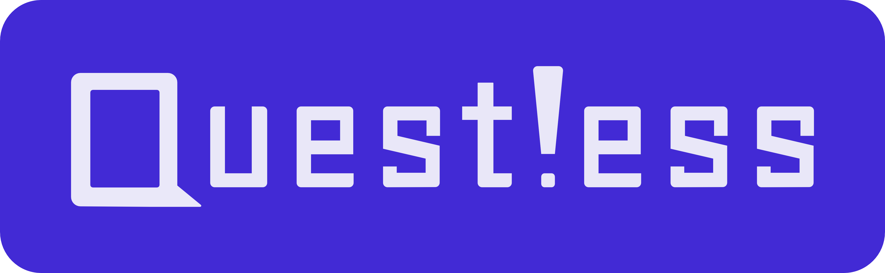
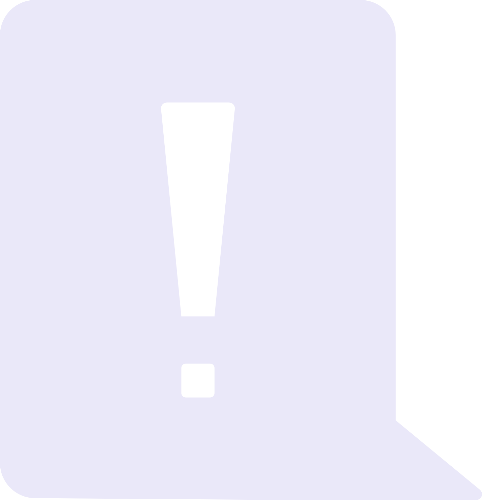

    
    <h3>To-do list program for neuro-divergent gamers to lessen their cognitive-load while playing sandbox games!</h3>

<h3></h3>

    
<b>Table of Contents</b>

  - [Project Overview](#-project-overview)
      - [Mission](#-mission)
      - [Why Questless?](#-why-questless?)
  - [Features](#-features)
  - [Get started](#-get-started)
      - [Installation](#-installation)
      - [Prototype](#-prototype)
      - [Official Release](#official-release)
  - [Latest Updates](#-latest-updates)
  - [Version](#-version)
  - [Upcoming Changes](#-upcoming-changes)
  - [Special Thanks](#-special-thanks)
  - [License](#-license)

## 🧐 Project Overview

### 🎯 Mission
To develop a digital tool to help neuro-divergent gamers lessen their cognitive load when playing open-world and sandbox games, so they can feel less overwhelm and experience games better.

###  Why Questless?
I constantly forget what I was doing in games whenever I take a break. Especially, in Sandbox games.
Instead of continuing to abandon games or reset worlds in the name of overwhelming forgetfulness, I decided to come up with a solution that lets me keep track of my creative gaming projects. Designed to do just one thing: support MY gaming journey throughout sandbox games.

## ⚙️ Features
- 🔒 Privacy: No cloud saves, no lack of privacy. The program uses local storage to save your gaming projects.
- 📵 No distractions: Use it on your second monitor and tune out all distractions. The first official release will be run as a program on your computer.
- 🎮 Playful & Fun: No need to be boring. This may be a specialized to-do list application, but that doesn't mean it has to be boring. Let's bring the playfulness into gaming tools.
- 👍 Easy to use: Easy to use and get started for most gamers. No matter the level of their computer literacy.
- 😌 One-step-undo for little mistakes: Deleted a task by accident? Changed the objective without meaning to? Just hit 'Ctrl+Z' and continue playing like nothing happened.
- ⏲ Fast & easy set-up: The point of this tool is not to get a new application in which you need to set aside 1+ hours of your day just to be able to use it. Gaming is the focus and we know that. Simply, add your game, add your objectives, and keep adding as you go. No need for complex set-ups when all we want is to play games as soon as we can.
- 🖱 Sort, drag & collapse: Sort your projects by creation date, drag and drop your projects and objectives wherever you want in the list, and collapse all projects with one click.
- 👩‍💻 Focus on one project at a time: Click on your projects to see more details about them. See all your objectives in one place without having to look at all your projects at once.

## 🌟 Get started
Here are some instructions on how to use this program:

### 💿 Installation
The current version of this program does not support installation just yet. The porting with Electron will happen during the second sprint, before the 1.0 release.

### 🖱️ Prototype
Through the prototype, you'll be able to access an Alpha version of the application with some features missing. It is only for demonstration purposes, which means that the features and usability are limited at this time.

To access it, go to the following link.

### Official Release
The 1.0 release is going to be the first official release of this program. At the moment, I'm still working on this to make it a reality.

## ❗ Latest Updates

> \[!NOTE]
> ## [0.4.1] Alpha - 2026-04-08 - Branch v0.x -- Pushed to main
> ### Added
> - Aria labels to the HTML, where it was missing (accessibility).
>
> ### Fixed
> - Spelling mistakes in readme & changelog
> - Drawer button's positioning. Most of the button was not visible.
>
> #### Alpha [0.4] - 2026-04-08 -- Pushed to main
> ### Added
> - Collapse all button that shows when something is collapsable
> - Maximized version of the subtask table inside the task drawer when pressing the maximize button
> - Edit button to edit subtasks besides the subtask title
> - More & better code, to continue to have my sanity
> - Added a MIT License to this project
>
> ### Fixed
> - Input box for subtasks is now always visible and on the top of the list
>     - UI of the input box has also been changed to better match the Figma design
> - UI change in task drawer: Better alignment of the 'X' button
>     - The 'X' button is also slightly bigger
>
> ### Changed
> - Root task input box:
>     - Placeholder text and Add button made bigger for better readability and accessibility
>     - Colour of KBD component (in root task input) changed for better accessibility
> - Text in different placeholder and accessibility labels
> - Subtask title now is edited via clicking the edit button besides it, instead of double clicking the subtask's title
>
> ### Deprecated
> - Previous index.html deleted. Homepage.html took its place as the new index.html.

## 0️⃣ Version
The current latest version is Alpha 0.4.1. You can access it through the main and .

## 🗒️ Upcoming changes
- Adding grouping
- Adding the Gallery container in the task drawer
- Adding the ability to upload images
- Adding the ability to add games

## 💫 Special Thanks
I would like to give my special thanks to Alex Mocuta for his help and guidance on this project.

Also, I would like to thank the contributors and developers behind the DaisyUI, Tailwind CSS, Hero Icons and Bootstrap Icons libraries since this project makes use of their content.

## 🔑 License
This project is under the MIT license. If you want to know more information about it, refer to the LICENSE.txt file on this repo.
